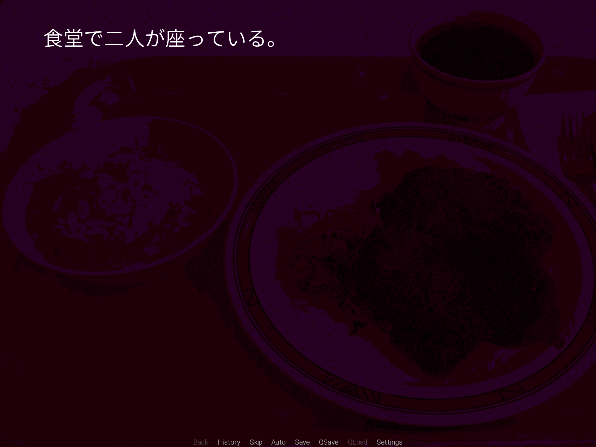
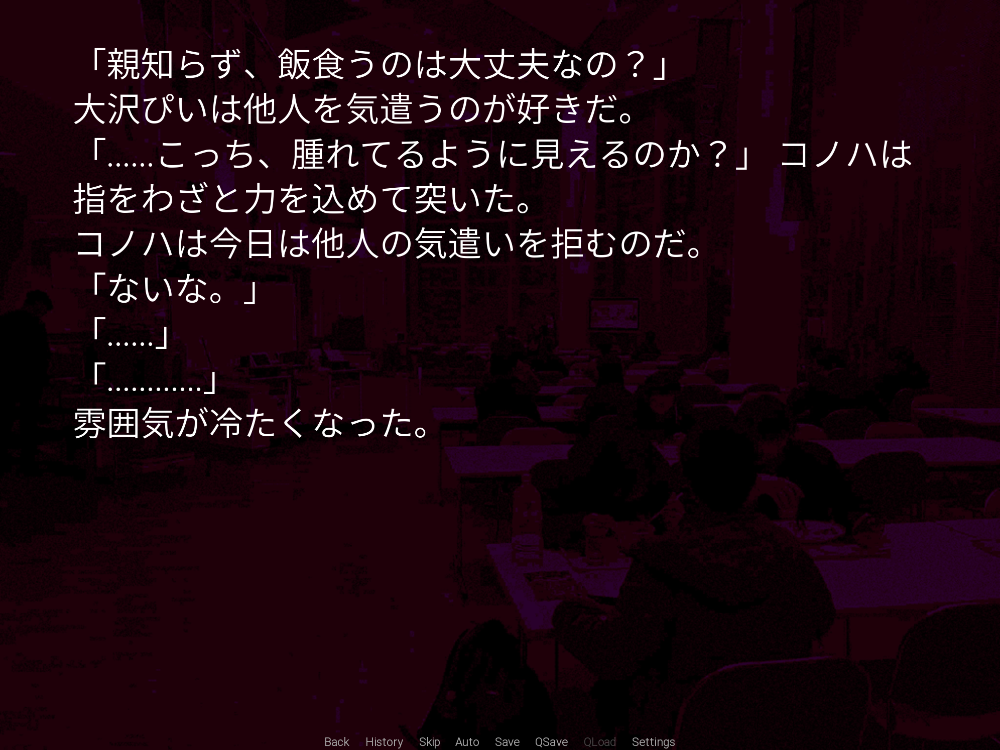
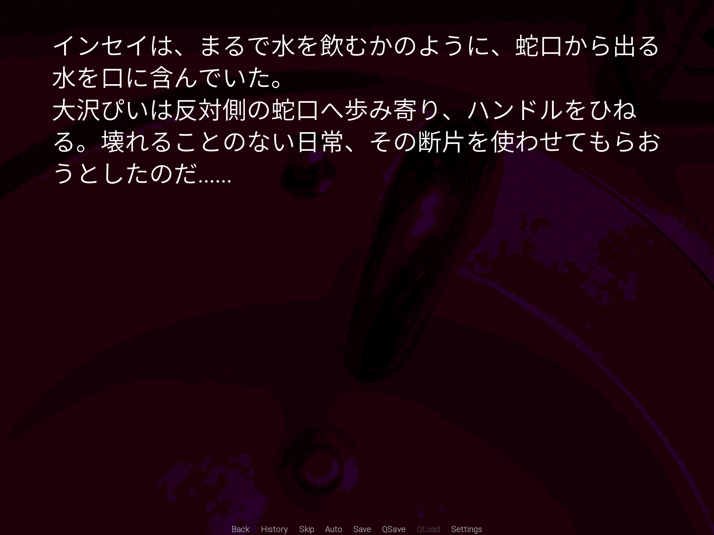

# Sinknomae Re

A short visual novel demo built with [Ren'Py](https://www.renpy.org/).
Story, scripting, photography and UI by **Jeremy**.

> **Language:** Japanese script. The game uses NVL-mode dialogue and is intended to be experienced as a short-form atmospheric piece.

---

## Play it

Pre-built binaries are attached to the [latest release](../../releases/latest):

- **macOS** — `SinknomaeRe-1.0-mac.zip`
- **Windows** — `SinknomaeRe-1.0-pc.zip`

> _Tip: on macOS you may need to right-click → Open the first time, since the build is unsigned._

---

## Screenshots

| | |
|---|---|
|  |  |
| _Opening beat — single line over a dimmed photograph._ | _NVL-mode passage — prose density used as a structural device._ |


_The sink — the recurring image the title is built around._

---

## About

`Sinknomae Re` is a short-form visual novel exploring a quiet conversation between two close friends. The piece leans on NVL-mode prose, photographic backgrounds and sound design rather than character sprites — the goal is something closer to a short film paced by reading speed than a traditional VN.

Approximate playtime: ~10–15 minutes.

---

## My role

I built this end to end as a solo project. Specifically:

- **Writing** — original Japanese script (`game/script.rpy`), including pacing, line breaks and the directing notes that drive the on-screen presentation.
- **Ren'Py scripting & direction** — scene flow, custom transitions (e.g. the `aa_flash` short-fade for emphasis), NVL-mode usage with explicit `nvl clear` beats, music queueing, and timing of `pause` / `window hide` for cinematic beats.
- **UI customization** — modified `screens.rpy` to skip the default title screen and jump straight into the story, and re-styled the bottom quick menu so it stays out of the way during reading.
- **Photography & art direction** — every background is an original photograph I took on location, post-processed with [Milk](https://github.com/LucaSinUnaS/Milk-Filter) to produce the consistent painterly look across `bg_*` images.

---

## Technical highlights

A few things worth pointing out if you're skimming the source:

- **NVL-mode dialogue** with manually-placed `nvl clear` boundaries — used as a structural device, not just a display mode.
- **Custom transitions** like `aa_flash = Fade(0.05, 0.0, 0.12, color="#ffffff")` defined alongside the dialogue for fine-grained directing.
- **Title-screen bypass** via `label splashscreen: jump start` so the demo feels more like a film and less like a software product.
- **Bottom quick-menu restyle** in `screens.rpy` to reduce visual chrome.

---

## Tech stack

- **Engine:** Ren'Py 8.x
- **Language:** Ren'Py script (Python-flavored DSL)
- **Font:** Source Han Sans (Light) — bundled
- **Photo post:** Milk Filter

---

## Build from source

You'll need the [Ren'Py SDK](https://www.renpy.org/latest.html) (8.x).

```bash
git clone https://github.com/760194962/Sinknomae-Re.git
```

Then in the Ren'Py launcher:

1. Add `Sinknomae Re/` as a project directory.
2. Hit **Launch Project** to play, or **Build Distributions** to produce platform binaries.

---

## Credits & asset notes

- **Background photos:** original, by Jeremy. Post-processed with Milk Filter.
- **Font:** [Source Han Sans](https://github.com/adobe-fonts/source-han-sans), distributed under the SIL Open Font License 1.1.
- **Music & SFX:** sourced from a mix of providers with varying licenses. They are bundled into the playable releases for convenience but the source repo intentionally includes them as-is for review purposes only — please don't redistribute the audio outside of trying out this demo.

---

## License

The code in this repository (`*.rpy`, build configs, etc.) is released under the [MIT License](LICENSE).

The bundled assets (background images, audio) are **not** covered by MIT and are included for the sole purpose of running this demo. See **Credits & asset notes** above.
